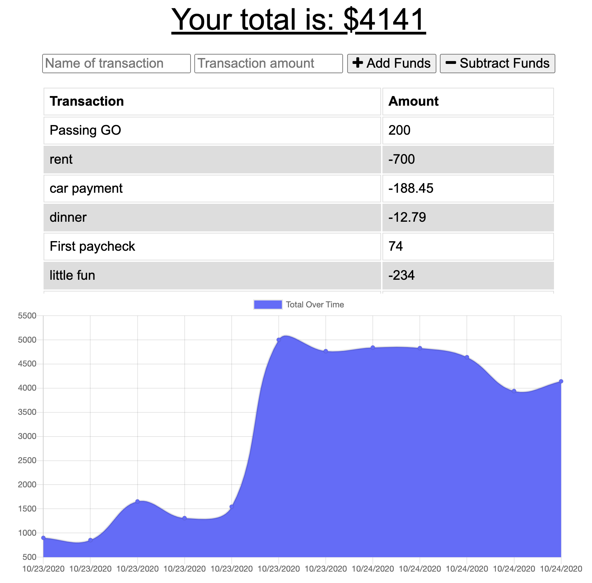

# Balance-Is-Key
"Better learn balance, balance is Key. – Lesson not just karate only. Lesson for whole life. Whole life have a balance. Everything be better."  - Mr. Miyagi
Knowing your balance at all times is key too, that's where 'Balance Is Key' comes in! Keep track of your deposits and withdrawals whether you're connected or not, and always know what your balance is.

[You can view the deployed app here:](https://balance-is-key.herokuapp.com/ "View Balance Is Key") https://balance-is-key.herokuapp.com/

## Table of Contents
- [Usage](#How-to-use)
- [Technologies](#Languages-and-Lessons)
- [Contribute](#How-to-contribute)
- [Questions](#Developed-by)
- [Credits](#Acknowledgments-and-Credits)
- [License](#Licensed-under-MIT)

## How to use
The app is very easy to use. Head to https://balance-is-key.herokuapp.com/, add your starting balance, then keep track of expenses as you go.

## Technologies
 - Node.js
 - Express
 - MongoDB/Atlas
 - Mongoose
 - Heroku

The exercises in this project focussed on learning progressive web app technologies, and providing users the ability to use app functionality even when they are offline.

## How to contribute
If anyone would like to improve the app by contributing, they're welcome to fork it and submit a pull request on [GitHub](https://github.com/keiththarp/Mongo-Workout-Watcher).

## Developed by
- [Keith Tharp](https://github.com/keiththarp)

Please reach out with questions at:
  - keithstharp@gmail.com

Find more of Keith Tharp's work at:
  - https://github.com/keiththarp

## Acknowledgments and Credits
Thank you to all my fellow students and study groups that helped and supported with this homework project!

## Licensed under MIT
[Click here for more information on the MIT license.](https://choosealicense.com/licenses/mit/)

